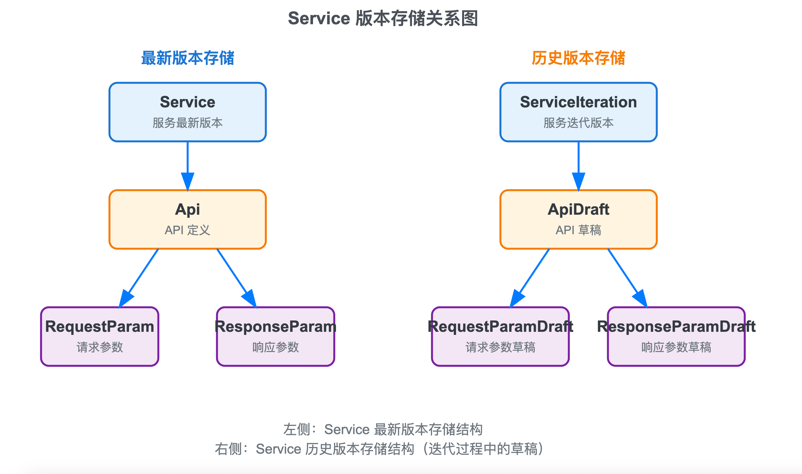

# BACKEND-NEXUS（后端）

本目录是 NEXUS 的后端服务（Python + Robyn + PostgreSQL）。项目整体说明见仓库根目录的 [README.md](../README.md)。

## 快速开始（本机开发）

**依赖**：Python（见 [pyproject.toml](pyproject.toml) 的 `requires-python`）、`uv`、PostgreSQL。

1) 安装依赖（首次运行）：

```bash
cd BACKEND-NEXUS
uv sync
```

2) 准备环境变量：复制 [.env.example](.env.example) 为 `.env` 并按实际填写。

3) 初始化数据库（首次搭建）：

- 先在 PostgreSQL 中创建用户/数据库（示例以 `.env.example` 默认值为准，用户/库名都是 `cam`）：

```sql
CREATE USER cam WITH PASSWORD 'YOUR_PASSWORD';
CREATE DATABASE cam OWNER cam;
GRANT ALL PRIVILEGES ON DATABASE cam TO cam;
```

- 然后在 `.env` 里填写 `DATABASE_*` / `DATABASE_URI`

- 创建表结构（首次建表建议用 `create_all`）：

```bash
cd BACKEND-NEXUS
uv run python -m database.init_db
```

4) 启动开发环境（热重载）：

```bash
cd BACKEND-NEXUS
./run-dev.ps1
```

后端默认监听 `http://127.0.0.1:1024`（根路径 `/` 返回 `OK`）。

启动后可访问交互式接口文档：

- Swagger UI：`http://127.0.0.1:1024/docs`
- OpenAPI JSON：`http://127.0.0.1:1024/openapi.json`

## 接口文档

本后端采用 **RPC 风格** 设计：查询类操作用 `GET`，其余写操作用 `POST`；路径以动词命名（如 `/getXxx`、`/deleteXxx`），**不是 RESTful 资源路径**。

### 通用约定

| 项 | 说明 |
|---|---|
| Base URL | `http://127.0.0.1:1024`（端口由 `.env` 中 `PORT` 控制） |
| 鉴权 | 除登录、注册、`/v1/docs`（公开服务可匿名）外，需在请求头携带 `Authorization: Bearer <access_token>` |
| 参数缺失 / 格式错误 | HTTP `400`，`description` 为错误说明 |
| 业务逻辑错误 | HTTP `200`，响应体中 `status` 为负数，`message` 为错误描述 |
| 查询成功 | HTTP `200`，直接返回数据对象或列表 |
| 写操作成功 | HTTP `200`，返回 `{ "status": 200, "message": "...", ... }` |

特殊权限：`/v1/user/getUserById` 仅 `L0` 用户可访问（见 `authentication.py` 中 `API_PERMISSION_MAP`）。

### 健康检查

| 方法 | 路径 | 鉴权 | 说明 |
|---|---|---|---|
| GET | `/` | 否 | 健康检查，返回 `OK` |

### 用户 `/v1/user`

| 方法 | 路径 | 鉴权 | 参数 | 功能 |
|---|---|---|---|---|
| GET | `/v1/user/getUserById` | 是（L0） | Query: `id` | 按用户 ID 获取用户详情 |
| GET | `/v1/user/getMyInfo` | 是 | — | 获取当前登录用户详情 |
| GET | `/v1/user/getUserByUsernameOrNicknameOrEmail` | 是 | Query: `username_or_nickname_or_email` | 按用户名 / 昵称 / 邮箱搜索用户 |
| POST | `/v1/user/login` | 否 | Body: `username`, `password` | 登录，返回 `access_token` |
| POST | `/v1/user/register` | 否 | Body: `username`, `password`, `nickname`, `email`, `role` | 注册新用户 |
| POST | `/v1/user/modifyPassword` | 是 | Body: `old_password`, `new_password` | 修改当前用户密码 |

### 服务 `/v1/service`

| 方法 | 路径 | 鉴权 | 参数 | 功能 |
|---|---|---|---|---|
| GET | `/v1/service/getServiceById` | 是 | Query: `id` | 按服务 ID 获取服务详情 |
| GET | `/v1/service/getAllServices` | 是 | Query: `page_size`（默认 10）, `current_page`（默认 1） | 分页获取全部服务 |
| GET | `/v1/service/getHisNewestServicesByOwnerId` | 是 | Query: `page_size`, `current_page`, `is_my_services`（默认 true）, `owner_id`（`is_my_services=false` 时必填） | 获取某用户拥有的最新版本服务列表 |
| GET | `/v1/service/getHisMaintainedServicesByUserId` | 是 | Query: `page_size`, `current_page`, `user_id`（默认当前用户） | 获取某用户维护的服务列表 |
| GET | `/v1/service/getServiceByUuidAndVersion` | 是 | Query: `service_uuid`, `version`（可为 `latest`） | 按 UUID 与版本获取服务详情（含分类与 API 聚合数据） |
| GET | `/v1/service/getAllVersionsByUuid` | 是 | Query: `service_uuid` | 获取某服务的全部历史版本号 |
| GET | `/v1/service/getAllDeletedServicesByUserId` | 是 | Query: `page_size`, `current_page` | 分页获取当前用户已软删除的服务 |
| GET | `/v1/service/isServiceMaintainer` | 是 | Query: `service_id`, `candidate_id` | 判断候选用户是否为该服务的维护者 |
| GET | `/v1/service/getIterationById` | 是 | Query: `id` | 获取指定迭代（ServiceIteration）详情 |
| GET | `/v1/service/compareVersionsByUuid` | 是 | Query: `service_uuid`, `base_version`, `compare_version` | 对比两个已发布版本的 Service/API/参数树差异 |
| GET | `/v1/service/exportOpenapiByUuidAndVersion` | 是 | Query: `service_uuid`, `version`（可为 `latest`） | 导出指定服务版本的 OpenAPI 3.1 JSON |
| POST | `/v1/service/createNewService` | 是 | Body: `service_uuid`, `description` | 创建新服务（初始版本 `0.0.1`） |
| POST | `/v1/service/addOrRemoveServiceMaintainerById` | 是 | Body: `service_id`, `candidate_id` | 添加或移除服务维护者 |
| POST | `/v1/service/deleteServiceById` | 是 | Body: `id` | 软删除服务（仅最新版本，历史版本保留） |
| POST | `/v1/service/restoreServiceById` | 是 | Body: `id` | 还原已软删除的服务 |
| POST | `/v1/service/deleteIterationById` | 是 | Body: `service_iteration_id` | 删除服务的历史迭代版本 |
| POST | `/v1/service/startIteration` | 是 | Body: `service_id` | 发起迭代，从当前最新版本复制草稿，返回 `service_iteration_id` |
| POST | `/v1/service/commitIteration` | 是 | Body: `service_iteration_id`, `new_version` | 提交迭代（直接发布）。服务已开启审批时，非 Owner/L0 不可用；`pending` 状态不可提交 |
| POST | `/v1/service/submitIterationForApproval` | 是 | Body: `service_iteration_id`, `new_version` | 提交审批（服务须开启 `requires_iteration_approval`），状态变为 `pending` |
| POST | `/v1/service/approveIteration` | 是 | Body: `service_iteration_id`, `review_comment`（可选） | Owner/L0 通过待审迭代，按 `proposed_version` 发布 |
| POST | `/v1/service/rejectIteration` | 是 | Body: `service_iteration_id`, `review_comment`（必填） | Owner/L0 驳回，状态变为 `rejected`，可继续编辑 |
| GET | `/v1/service/getPendingIterations` | 是 | Query: `page_size`, `current_page` | Owner 分页获取本人服务下待审迭代 |
| GET | `/v1/service/getIterationAuditLog` | 是 | Query: `service_iteration_id`, `page_size`, `current_page` | 获取迭代变更审计时间线 |
| GET | `/v1/service/getIterationChangePreview` | 是 | Query: `service_iteration_id` | 获取相对 `base_version` 的变更预览（diff） |
| POST | `/v1/service/updateServiceApprovalSetting` | 是 | Body: `service_id`, `requires_iteration_approval` | Owner 开启/关闭服务的「迭代需审批」 |
| POST | `/v1/service/updateDocsPublicSetting` | 是 | Body: `service_id`, `docs_public` | Owner 开启/关闭服务的「公开文档门户」 |
| POST | `/v1/service/updateDescription` | 是 | Body: `service_iteration_id`, `description` | 在迭代中修改服务描述 |
| POST | `/v1/service/importOpenapiToNewIteration` | 是 | Body: `service_id`, `openapi_object` | 从 OpenAPI 文档创建新迭代并写入草稿 |
| POST | `/v1/service/importOpenapiToIteration` | 是 | Body: `service_iteration_id`, `openapi_object` | 将 OpenAPI 文档导入当前迭代（覆盖草稿） |

### API 与分类 `/v1/api`

| 方法 | 路径 | 鉴权 | 参数 | 功能 |
|---|---|---|---|---|
| GET | `/v1/api/getAllCategoriesByServiceId` | 是 | Query: `service_id` | 获取服务的全部分类 |
| GET | `/v1/api/getAllApisByServiceId` | 是 | Query: `service_id`, `category_id` | 获取某分类下的 API 列表 |
| GET | `/v1/api/getApiById` | 是 | Query: `api_id`, `is_latest`（默认 true） | 获取 API 详情（正式版或草稿版） |
| POST | `/v1/api/addCategoryByServiceId` | 是 | Body: `service_id`, `category_name`, `description` | 新增 API 分类 |
| POST | `/v1/api/deleteCategoryById` | 是 | Body: `category_id`, `service_iteration_id`（可选，迭代中删除时传入） | 删除分类 |
| POST | `/v1/api/updateCategoryById` | 是 | Body: `category_id`, `category_name`, `description` | 更新分类名称与描述 |
| POST | `/v1/api/updateApiCategoryById` | 是 | Body: `api_id`, `category_id` | 修改已发布 API 所属分类（非迭代操作） |
| POST | `/v1/api/addApi` | 是 | Body: `service_iteration_id`, `name`, `method`, `path`, `description`, `level`, `category_id`（可选） | 在迭代中新增 API 草稿 |
| POST | `/v1/api/copyApiByApiDraftId` | 是 | Body: `service_iteration_id`, `api_draft_id` | 在同一迭代内复制 API 草稿 |
| POST | `/v1/api/deleteApiByApiDraftId` | 是 | Body: `service_iteration_id`, `api_draft_id` | 在迭代中删除 API 草稿 |
| POST | `/v1/api/updateApiByApiDraftId` | 是 | Body: `service_iteration_id`, `api_draft_id`, `name`, `method`, `path`, `description`, `level`, `req_params`, `resp_params`（后两者为 JSON 字符串） | 在迭代中更新 API 草稿及其请求 / 响应参数树 |

> 说明：前端通常通过 `getServiceByUuidAndVersion` 一次性获取分类与 API 聚合数据，因此 `getAllCategoriesByServiceId`、`getAllApisByServiceId` 在前端较少直接调用。

### 文档门户 `/v1/docs`

只读接口，面向对外 API 文档页。与 `/v1/service` 中同名接口的数据形态类似，但访问控制不同：

- 服务已开启 `docs_public` 时：**无需登录**即可访问已发布版本
- 未开启公开时：须携带有效 Token，且为 Owner / Maintainer / L0 方可预览

| 方法 | 路径 | 鉴权 | 参数 | 功能 |
|---|---|---|---|---|
| GET | `/v1/docs/getServiceByUuidAndVersion` | 可选 | Query: `service_uuid`, `version`（可为 `latest`） | 获取服务详情（含分类与 API 聚合数据） |
| GET | `/v1/docs/getAllVersionsByUuid` | 可选 | Query: `service_uuid` | 获取某服务的全部历史版本号 |
| GET | `/v1/docs/getApiById` | 可选 | Query: `api_id`, `is_latest`（默认 true） | 获取 API 详情（正式版或历史迭代版） |
| GET | `/v1/docs/exportOpenapiByUuidAndVersion` | 可选 | Query: `service_uuid`, `version`（可为 `latest`） | 导出指定服务版本的 OpenAPI 3.1 JSON |

> 说明：「可选鉴权」指不强制 `Authorization` 头；未公开服务在无有效 Token 时将返回业务错误。开关由 Owner 通过 `updateDocsPublicSetting` 控制。

### Mock `/v1/mock`

在线 Mock 与代理，用于在管理端按 API 定义快速验证响应形态。支持正式版、历史版本与迭代草稿。

| 方法 | 路径 | 鉴权 | 参数 | 功能 |
|---|---|---|---|---|
| POST | `/v1/mock/executeMock` | 是 | Body: `api_id`, `is_latest`（默认 true）, `status_code`（可选）, `request`（可选） | 按 API 定义生成 Mock 响应 |
| GET | `/v1/mock/getMockDefaults` | 是 | Query: `api_id`, `is_latest`（默认 true） | 获取该 API 的默认 Mock 请求参数示例 |
| GET | `/v1/mock/proxy` | 是 | Query: `service_uuid`, `mock_path`, `version`（可选，默认 `latest`）, `service_iteration_id`（可选，迭代草稿） | 按 HTTP 方法与 `mock_path` 匹配 API 并返回 Mock 响应 |
| POST | `/v1/mock/proxy` | 是 | Query 同上；Body: JSON，可含 `request` 字段或整包作为请求输入 | 同上（POST） |
| PUT | `/v1/mock/proxy` | 是 | 同 POST | 同上（PUT） |
| DELETE | `/v1/mock/proxy` | 是 | 同 GET | 同上（DELETE） |
| PATCH | `/v1/mock/proxy` | 是 | 同 POST | 同上（PATCH） |

## 环境变量（`.env`）

环境变量文件不纳入 git，请从 [.env.example](.env.example) 复制后修改。字段如下：

```ini
# App
PYTHONPATH=<YOUR-PROJECT-PATH>
PORT=1024

# Auth
ALGORITHM=HS256
LOGIN_SECRET=<YOUR-LOGIN-SECRET>

# Database (PostgreSQL)
DATABASE_ENGINE=postgresql+psycopg2
DATABASE_USERNAME=<YOUR-DATABASE-USERNAME>
DATABASE_PASSWORD=<YOUR-DATABASE-PASSWORD>
DATABASE_HOST=<YOUR-DATABASE-HOST>
DATABASE_PORT=<YOUR-DATABASE-PORT>
DATABASE_NAME=<YOUR-DATABASE-NAME>
DATABASE_URI=postgresql+psycopg2://<YOUR-DATABASE-USERNAME>:<YOUR-DATABASE-PASSWORD>@<YOUR-DATABASE-HOST>:<YOUR-DATABASE-PORT>/<YOUR-DATABASE-NAME>

# Mail (optional; used when committing iteration)
MAIL_SERVER=smtp.example.com
MAIL_PORT=465
MAIL_USERNAME=your_email@example.com
MAIL_PASSWORD=your_smtp_password
MAIL_DEFAULT_SENDER=your_email@example.com
```

## 数据库迁移（模型变更时）

项目已配置 [Alembic](https://alembic.sqlalchemy.org/)（`alembic.ini`、`alembic/env.py`），连接串从 `.env` 的 `DATABASE_URI` 读取，元数据来自 `database/models.py`。

### 已有表（本地 / 服务器均如此）

首次接入迁移、且**尚未**执行过迭代审批相关 DDL 时，在 `BACKEND-NEXUS` 目录：

```powershell
# 仅应用已提交的 revision（推荐）
.\database\db-migrate.ps1
```

```bash
bash database/db-migrate.sh
```

若在 Linux 上出现 `$'\r': command not found` 或 `set: invalid option`，说明脚本是 Windows 换行符，先执行：

```bash
sed -i 's/\r$//' database/db-migrate.sh
```

或直接：`uv run alembic upgrade head`。

等价于 `uv run alembic upgrade head`，会执行 `alembic/versions/20250604_001_iteration_approval.py`（审批字段 + `iteration_audit_log`）。

若你**已经手工执行过** [docs/migrations/20250604_iteration_approval.sql](../docs/migrations/20250604_iteration_approval.sql)，不要再 `upgrade`，只需标记版本：

```bash
uv run alembic stamp 20250604_001
```

### 后续修改 models.py

1. 生成新 revision（需数据库可连、用于 autogenerate 对比）：

   - Windows：`.\database\db-migrate.ps1 -Generate -Message "describe change"`
   - Linux/macOS：`bash database/db-migrate.sh --generate "describe change"`

2. 检查 `alembic/versions/` 下新生成的脚本，确认无误后再 `upgrade head`（不带 `-Generate` 的 `db-migrate` 脚本只会升级）。

### 全新空库

仍可用 `uv run python -m database.init_db` 建表；若要走 Alembic 线，可在建表后 `uv run alembic stamp head` 与线上一致。

### 部署

`deploy/scripts/deploy.sh` 在 `RUN_DB_MIGRATE=true` 且存在 `alembic.ini` 时会执行 `alembic upgrade head`（不 autogenerate）。

## 后端逻辑摘要

-   后端技术选型采用 `Python Robyn` 框架，数据库采用 `PostgreSQL`
-   安装依赖使用 `uv sync`；开发热重载可使用 `uv run robyn -m app --dev` 或脚本 `run-dev.ps1/run-dev.sh`
-   项目默认监听 `1024` 端口，可通过修改 `.env` 中的环境变量 `PORT` 修改

以下内容为项目内部逻辑与数据结构说明。

## 数据库表设计

-   使用 `SQLAlchemy` 进行数据库 `ORM` 映射，全部数据库相关放到 `database` 目录中，包含：

    -   `models.py`：数据库表 `ORM` 类
    -   `enums.py`：枚举类，即自定义类型，例如 `ApiLevel`、`UserLevel` 等
    -   `database.py`：数据库连接与配置，定义 `session` 工厂
    -   `db-migrate.sh`：【见下条】

-   数据库首次建表建议使用 [database/init_db.py](database/init_db.py) 的 `create_all`：

    ```bash
    uv run python -m database.init_db
    ```

-   `database/models.py` 中数据库表修改后可使用迁移脚本（前提：你本地已配置好 Alembic）：

    -   macOS/Linux：`bash database/db-migrate.sh`
    -   Windows PowerShell：`./database/db-migrate.ps1`（或 `.\\database\\db-migrate.ps1`）

-   为方便每个表的记录的 `json` 化，让所有表继承自 `SerializableMixin` 基类，包含序列化 `toJson()` 方法，可选择保留属性、排除属性以及是否包含关系表字段；为避免循环引用，`toJson()` 实现时内部 `toJson()` 方法不得设定 `include_relations=True`。

-   `service-maintainer` 为多对多关系，通过中间表 `user_service_link` 关联

-   `ApiLevel` 枚举类从 `P0` 到 `P4` 重要性递减

-   `UserLevel` 枚举类从 `L0` 到 `L4` 权限递减。暂时只考虑 `L0` 和 `L4` 两类用户：`L0` 为超级管理员，有权限访问全部 `API`；`L4` 为普通用户，只可访问自己的 `service`、`api` 等资源。未确定中间类别的用户权限

## 服务与 API 实现

-   将全部服务分为 `user`、`service`、`api`、`docs`、`mock` 五类，分别对应五个子路由（`docs` 为只读文档门户，`mock` 为在线 Mock）

-   每个路由实现内部逻辑都交由 `service` 层处理。路由层仅负责接收请求参数、调用 `service` 层方法、返回响应。`service` 层再调用对应的 `model` 层方法进行数据库的 `CRUD`

-   本项目中 `service` 层的方法规范：

    -   方法命名为 `<service_name><operation_name>`，例如 `userLogin()`、`serviceGetAllCategoriesByServiceId()` 等。避免和路由及路由函数函数重名
    -   传入 `SQLAlchemy Session` 实例，命名为 `db`，以及其他所需参数；
    -   请求成功 `200` 时，返回区分 `get` 操作与其他操作，均返回对象，对象值为：
        -   `get` 操作：单个对象或对象列表
        -   其他操作：成功 `message` 与其他必要数据
    -   请求失败 `4xx` 或 `5xx` 时，返回 `Robyn Response` 对象：

        ```python
        return Response(
            status_code=<Fail status code>,
            headers={},
            description="<Fail message>",
        )
        ```

-   **鉴权**

    -   通过 `Robyn` 内置的 `AuthenticationHandler` 实现，具体逻辑在 `authentication.py` 中
    -   登录生成 `access token` 并在后续请求 `Header` 中 `Authorization` 字段携带，格式为 `Bearer <access_token>`
    -   接口鉴权通过 `Robyn` 内置的 `BearerGetter()` 方法获取 `access token` 并进行验证；另外，在 `user` 相关 `service` 中另实现了 `userGetUserIdByAccessToken()` 方法，可传入 `Robyn Request` 或 `access token` 解析出 `user_id`。但注意：二者只能二选一传入
    -   在 `authentication.py` 中定义 `API_PERMISSION_MAP`，用于存储每个 `API` 允许访问的**最低** `UserLevel` 的映射。若 `API` 不在该 `map` 中，默认允许所有用户访问
    -   每个子路由中添加鉴权中间件

        ```python
        <subRouter>.configure_authentication(AuthHandler(token_getter=BearerGetter()))
        ```

        在每个路由中设定 `auth_required=True` 开启鉴权，即只有登录用户有权限访问

-   错误处理：对于一个 API，若缺少必要参数或参数格式错误，返回 `400 Bad Request` 错误；而其他逻辑错误（例如密码错误），则响应正常返回 `200` ，附带 `status` 为负， `message` 为错误描述。

### service 相关

-   每个 `service` 有一个 `owner`，多个 `maintainer`，但计划 `MVP` 版本不引入 `maintainer`。因此除了 `L0` 用户外，只有 `owner` 才能操作其 `service`

-   每个 `service` 中包含一个唯一的 `service_uuid`，用于标识该 `service`。

    -   `service_uuid` 命名格式为 `a/b/c`，`a`、`b`、`c` 均为小写字母或数字，三者均由用户自定义
    -   `version` 命名格式为 `X.Y.Z`，其中 `X`、`Y`、`Z` 均为非负整数。所有服务初始版本均为 `0.0.1`

    **二者在前端做正则校验**

-   `api` 的 `category` 切换只支持在 `service` 最新版本中进行，不属于 `service` 迭代周期内的行为

### ⚠️ Service 版本管理

-   一次 `service` 迭代周期内包含以下几种行为：

    -   修改 `service description`
    -   新增 `API`
    -   删除 `API`
    -   编辑 `API`（包含 `API` 自有属性、请求参数以及响应参数）

-   `Service` 表存储每个 `service` 的最新版本，而 `ServiceIteration` 表存储每个 `service` 迭代周期内的所有变更。`Service` 表中的 `version` 与 `ServiceIteration` 表中当前 `service` 的最新 `version` 对齐

-   

-   `ServiceIteration` 被标记 `is_committed=False` 时，代表正在当前 `service` 的迭代周期，每个 `service` 每个用户只能有一个迭代周期在进行中；`ServiceIteration` 被标记 `is_committed=True` 时，代表该迭代周期已完成，作为当前 `service` 的历史版本记录

#### service 版本迭代流程

1. 用户发起 `service` 迭代流程 `/startIteration`，创建一个新迭代周期 `ServiceIteration` 记录，标记 `is_committed=False`，并将当前服务最新版本全部信息备份到 `ServiceIteration`，返回一个 `service_iteration_id`，存在客户端，作为本迭代周期的唯一标识

2. 用户在本迭代周期内进行上述四种行为，每次行为均在 `ServiceIteration` 中进行记录。每个行为发生需要通过 `service_iteration_id` 标识当前迭代周期：

    - 修改 `service description`：将修改后的 `description` 存储到 `ServiceIteration`
    - 新增 `API`：新增一条 `ApiDraft` 记录，只记录新增的 `API` 自有信息（`name`、`method`、`path`、`description`、`level`、`category_id`（可选））
    - 删除 `API`：通过 `api_draft_id` 删除 `ApiDraft` 记录，同时利用 `CASCADE` 删除其关联的请求参数和响应参数
    - 编辑 `API`：【⚠️ 复杂】通过 `api_draft_id` 定位到 `ApiDraft` 记录，更新其自有属性（`name`、`method`、`path`、`description`、`level`、`category_id`（可选））。之后，删除其关联的全部请求参数和响应参数，并根据传入的请求参数和响应参数，更新其关联的请求参数和响应参数。

        > 传入 `req_params` 格式约定：
        >
        > ```json
        > [
        >     {
        >         "name": "user",
        >         "location": "body",
        >         "type": "object",
        >         "required": true,
        >         "default_value": null,
        >         "description": "用户信息",
        >         "example": "{}",
        >         "array_child_type": null,
        >         "children": [
        >             {
        >                 "name": "name",
        >                 "type": "string",
        >                 "required": true,
        >                 "default_value": null,
        >                 "description": "用户姓名",
        >                 "example": "张三",
        >                 "array_child_type": null,
        >                 "children": null
        >             },
        >             {
        >                 "name": "profile",
        >                 "type": "object",
        >                 "required": false,
        >                 "default_value": null,
        >                 "description": "用户档案",
        >                 "example": "{}",
        >                 "array_child_type": null,
        >                 "children": [
        >                     {
        >                         "name": "age",
        >                         "type": "int",
        >                         "required": true,
        >                         "default_value": null,
        >                         "description": "年龄",
        >                         "example": "25",
        >                         "array_child_type": null,
        >                         "children": null
        >                     }
        >                 ]
        >             }
        >         ]
        >     },
        >     {
        >         "name": "tags",
        >         "location": "query",
        >         "type": "array",
        >         "required": false,
        >         "default_value": null,
        >         "description": "标签列表",
        >         "example": "[\"tag1\", \"tag2\"]",
        >         "array_child_type": "string",
        >         "children": null
        >     }
        > ]
        > ```
        >
        > `resp_params` 类似，只是 `location` 换为 `status_code`

3. 用户在本迭代周期内完成所有行为后发布版本：

    - **未开启审批**（默认）：`/commitIteration`，输入 `new_version` 后直接写回正式表
    - **已开启审批**：提交人 `/submitIterationForApproval` → Owner `/approveIteration` 发布；或 Owner/L0 `/commitIteration` 直接发布。`approval_status=pending` 时禁止一切草稿编辑（见 `services/utils.py`）

    发布时将 `ServiceIteration` 及其 `ApiDraft`/参数草稿同步到 `Api`/`RequestParam`/`ResponseParam`，更新 `service.version`，`is_committed=True`，`approval_status=committed`。

#### 迭代审批与变更审计

- 产品说明见 [docs/PRD.md §6.7](../docs/PRD.md#67-迭代审批与变更审计可选)
- 实现：`services/iteration_approval.py`、`services/iteration_audit.py`、`services/iteration_commit.py`；路由见上文「迭代审批」相关接口
- `approval_status`：`draft` | `pending` | `rejected` | `committed`（与 `is_committed` 配合）
- `iteration_audit_log`：记录 API 增删改及提交/通过/驳回/提交发布等事件（`database/enums.py` → `IterationAuditAction`）
- 数据库迁移：`alembic/versions/20250604_001_iteration_approval.py` 或 [docs/migrations/20250604_iteration_approval.sql](../docs/migrations/20250604_iteration_approval.sql)
